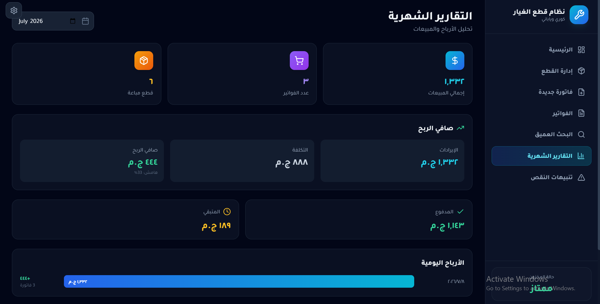
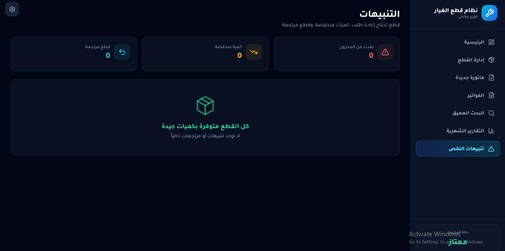
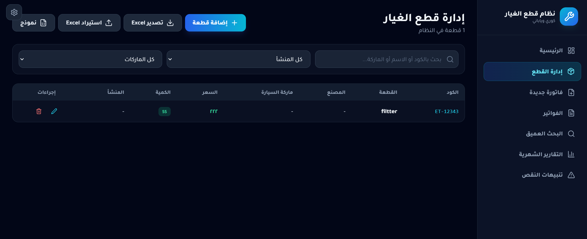
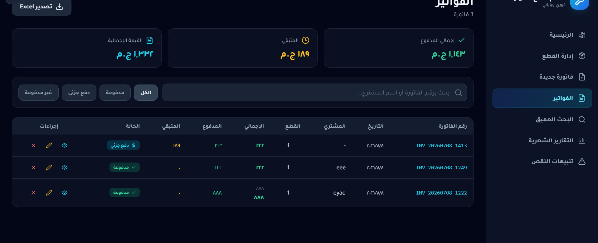
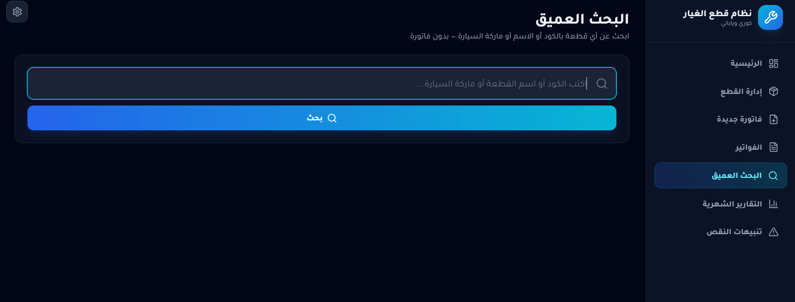

# Auto Parts Shop Management System

A complete inventory and sales management system built for a real-world auto parts shop, handling stock tracking, sales transactions, invoicing, and daily record-keeping. This was the developer's first application deployed and actively used in a real business — not a class project or demo.

## Origin & Evolution

The project began as a **web application** built with **HTML, CSS, and JavaScript**, connected to a **Supabase** backend for authentication and real-time data sync. It was deployed at the shop and proved effective for daily operations.

However, the shop's unreliable internet connection made a cloud-dependent system impractical — any downtime meant the app stopped working. This drove the decision to rebuild the system as a fully **offline desktop application**.

## The Offline Transition — Built with AI Assistance

Since converting a web app into an offline desktop app required architecture knowledge (Electron IPC, local database design, replacing a cloud backend with local persistence) beyond the developer's experience at the time, **Claude (Anthropic's AI assistant)** was used as a hands-on development partner throughout the rebuild.

Claude helped with:
- Restructuring the app into an **Electron** desktop app, with the local machine acting as its own self-contained server for full offline use
- Migrating the frontend to **React** and **TypeScript**
- Replacing the Supabase cloud backend with a **local JSON database (lowdb)**, accessed through Electron IPC and wrapped in a Supabase-compatible query API — so the rest of the app's logic barely had to change
- Debugging integration issues (data flow bugs, Electron build/packaging errors, UI inconsistencies introduced during migration)
- Styling the new UI with **Tailwind CSS**
- Adding features like invoice creation, monthly financial reports, low-stock alerts, and Excel import/export
- Iteratively testing and fixing edge cases until the offline app matched the reliability of the original web version

This was an incremental process — features were implemented, tested in the real shop, and refined based on actual issues encountered, rather than requested as a single finished product.

## Real-World Impact

This system was actually deployed and used in a functioning auto parts shop, validating its design against real inventory, sales, and connectivity conditions. It gave the developer:

- Practical full-stack development experience, start to finish
- Direct exposure to solving real infrastructure constraints (offline-first design)
- A genuine introduction to AI-assisted development — directing, debugging, and validating AI-generated code
- End-to-end understanding of a software product's lifecycle, from web prototype to a production desktop tool

## Features

- Dashboard with financial overview
- Parts inventory management with low-stock alerts
- Invoice creation and invoice history
- Monthly financial reports
- Deep search across inventory
- Excel import/export for inventory data
- Password-protected access to sensitive financial data
- Configurable settings
- Fully offline — no internet connection required


## Screenshots

### Dashboard


### Parts Management


### New Invoice


### Invoices List


### Deep Search


### Monthly Reports


### Low Stock Alerts


### Settings
 


## Tech Stack

| Category | Technologies |
|---|---|
| Frontend | React, TypeScript, Tailwind CSS |
| Desktop Runtime | Electron |
| Local Database | lowdb (JSON-based), accessed via Electron IPC |
| Data Handling | xlsx (Excel import/export) |
| Original Version | HTML, CSS, JavaScript, Supabase |
| Development Assistance | Claude (Anthropic) |

## Installation & Setup

### Prerequisites
- Node.js (v18 or higher recommended)
- npm

### Steps

1. Clone the repository
   ```bash
   git clone https://github.com/your-username/autoparts-manager.git
   cd autoparts-manager
   ```

2. Install dependencies
   ```bash
   npm install
   ```

3. Run the app in development mode (starts Vite + Electron together)
   ```bash
   npm run electron:dev
   ```

4. Build a distributable desktop app (Windows installer)
   ```bash
   npm run electron:build:win
   ```
   The installer will be generated in the `release/` folder.

> **Note:** This application runs fully offline. All data is stored locally on the machine — no external server, database, or internet connection is required after installation.

## Project Structure

```
├── electron/           # Electron main process & preload scripts
├── src/
│   ├── components/     # React UI components
│   └── lib/             # Local database adapter, business logic, types
├── supabase/
│   └── migrations/     # Original Supabase schema (kept for reference)
└── build/               # App icon & build resources
```
